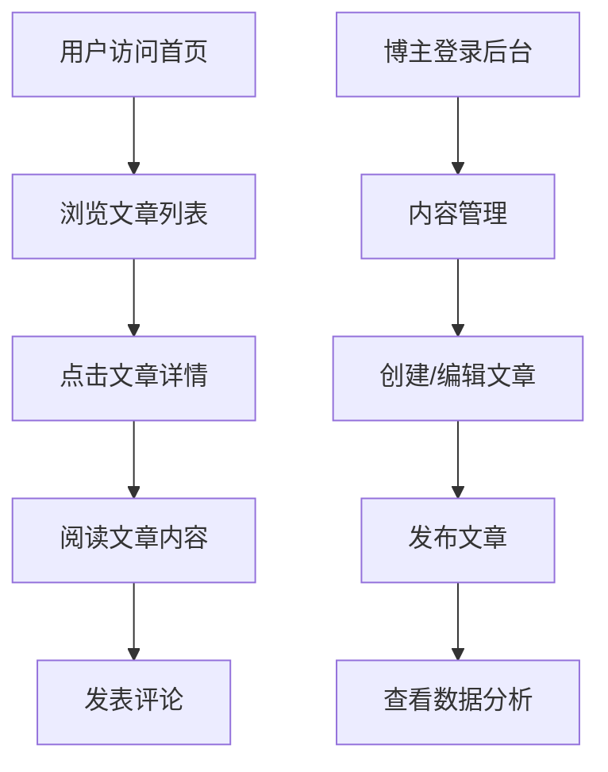

## 1. 产品概述
IMBG是一个现代化的个人博客平台，帮助用户轻松创建和管理个人内容。
- 解决个人创作者发布内容的痛点，提供简洁高效的内容管理系统
- 目标用户为博客作者、内容创作者和个人品牌建设者
- 产品价值在于降低内容创作门槛，提升内容管理效率

## 2. 核心功能

### 2.1 用户角色
| 角色 | 注册方式 | 核心权限 |
|------|---------------------|------------------|
| 普通用户 | 邮箱注册 | 浏览和评论内容 |
| 博主 | 邮箱注册 + 身份验证 | 发布、编辑、管理内容 |

### 2.2 功能模块
1. **首页**：英雄区、导航栏、文章列表、分类筛选
2. **文章详情页**：文章内容、评论系统、相关推荐
3. **管理后台**：内容管理、用户管理、数据分析

### 2.3 页面详情
| 页面名称 | 模块名称 | 功能描述 |
|-----------|-------------|---------------------|
| 首页 | 英雄区 | 展示博客主题和最新内容，支持轮播效果 |
| 首页 | 文章列表 | 以卡片形式展示文章，支持分页和排序 |
| 首页 | 分类筛选 | 按分类标签筛选文章内容 |
| 文章详情页 | 文章内容 | 展示完整文章，支持富文本格式 |
| 文章详情页 | 评论系统 | 支持用户评论和回复，显示评论时间 |
| 文章详情页 | 相关推荐 | 根据文章标签推荐相关内容 |
| 管理后台 | 内容管理 | 发布、编辑、删除文章，支持草稿功能 |
| 管理后台 | 用户管理 | 查看用户列表，管理用户权限 |
| 管理后台 | 数据分析 | 展示文章阅读量、评论数等统计数据 |

## 3. 核心流程
用户浏览流程：访问首页 → 浏览文章列表 → 点击文章查看详情 → 发表评论

博主管理流程：登录后台 → 创建/编辑文章 → 发布文章 → 查看数据统计

## 4. 用户界面设计
### 4.1 设计风格
- 主色调：深蓝色 (#165DFF) 和白色 (#FFFFFF)
- 辅助色：浅灰色 (#F5F7FA) 和深灰色 (#333333)
- 按钮风格：圆角按钮，主按钮使用主色调，次要按钮使用浅灰色
- 字体：标题使用 Montserrat，正文使用 Inter
- 字体大小：标题 24-36px，正文 16px，辅助文字 14px
- 布局风格：卡片式布局，顶部导航栏，响应式设计
- 图标风格：线性图标，使用 Lucide React 图标库

### 4.2 页面设计概览
| 页面名称 | 模块名称 | UI元素 |
|-----------|-------------|-------------|
| 首页 | 英雄区 | 全屏背景图，标题文字居中，渐变色覆盖，CTA按钮 |
| 首页 | 文章列表 | 卡片式布局，每张卡片包含标题、摘要、封面图、发布时间和分类标签 |
| 首页 | 分类筛选 | 水平滚动的标签栏，选中状态高亮显示 |
| 文章详情页 | 文章内容 | 干净的白色背景，清晰的排版，适当的行间距和段落间距 |
| 文章详情页 | 评论系统 | 评论列表采用嵌套式布局，评论输入框固定在底部 |
| 文章详情页 | 相关推荐 | 侧边栏卡片式布局，显示推荐文章标题和封面图 |
| 管理后台 | 内容管理 | 表格形式展示文章列表，操作按钮位于每行末尾 |
| 管理后台 | 用户管理 | 表格形式展示用户列表，支持搜索和筛选 |
| 管理后台 | 数据分析 | 图表形式展示数据，支持时间范围选择 |

### 4.3 响应式设计
- 采用桌面优先设计，适配移动端和 tablet 设备
- 断点设置：
  - 移动端：< 768px
  - 平板：768px - 1024px
  - 桌面：> 1024px
- 移动端适配：导航栏转为汉堡菜单，文章列表变为单列布局
- 触摸优化：按钮和可点击元素尺寸不小于 44px × 44px

### 4.4 3D场景指导
- 不适用，本项目为2D博客平台