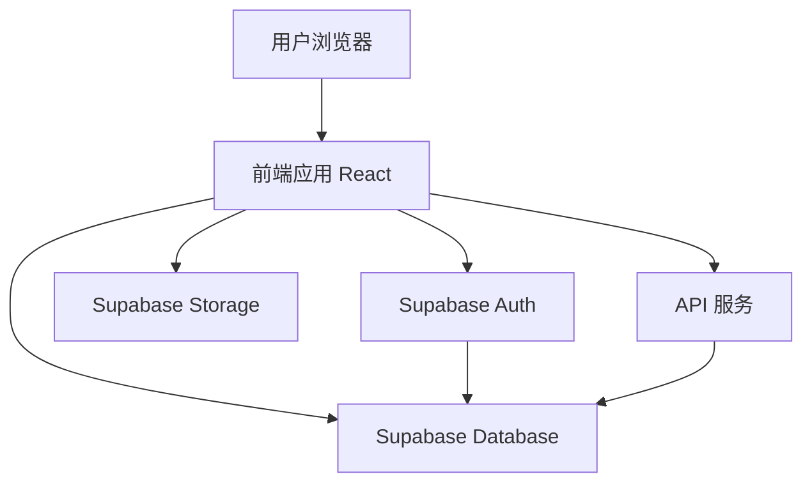
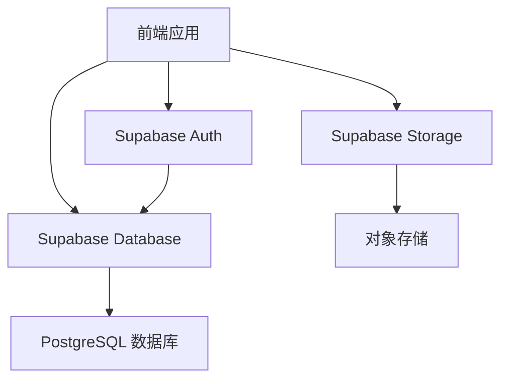
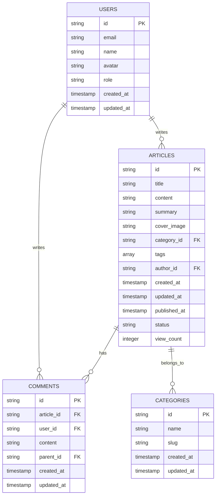

## 1. 架构设计


## 2. 技术描述
- 前端：React@18 + TypeScript + Tailwind CSS@3 + Vite
- 初始化工具：vite-init
- 后端：Supabase (Auth, Database, Storage)
- 数据库：Supabase (PostgreSQL)
- 状态管理：Zustand
- 路由：React Router DOM
- UI 组件：自定义组件 + Lucide React 图标

## 3. 路由定义
| 路由 | 目的 |
|-------|---------|
| / | 首页，展示文章列表 |
| /article/:id | 文章详情页 |
| /category/:slug | 按分类筛选文章 |
| /admin | 管理后台首页 |
| /admin/articles | 文章管理页面 |
| /admin/articles/create | 创建文章页面 |
| /admin/articles/edit/:id | 编辑文章页面 |
| /admin/users | 用户管理页面 |
| /admin/analytics | 数据分析页面 |
| /login | 登录页面 |
| /register | 注册页面 |

## 4. API 定义
### 4.1 前端 API 调用
- 使用 Supabase Client SDK 直接与 Supabase 服务交互
- 主要 API 调用包括：
  - 认证相关：登录、注册、登出
  - 文章相关：获取文章列表、获取文章详情、创建/编辑/删除文章
  - 评论相关：获取评论、创建评论、删除评论
  - 用户相关：获取用户信息、更新用户信息

### 4.2 数据类型定义
```typescript
// 文章类型
type Article = {
  id: string;
  title: string;
  content: string;
  summary: string;
  coverImage: string;
  category: string;
  tags: string[];
  authorId: string;
  createdAt: string;
  updatedAt: string;
  publishedAt: string | null;
  status: 'draft' | 'published';
  viewCount: number;
};

// 评论类型
type Comment = {
  id: string;
  articleId: string;
  userId: string;
  content: string;
  parentId: string | null;
  createdAt: string;
  updatedAt: string;
  user: {
    id: string;
    email: string;
    name: string;
    avatar: string;
  };
};

// 用户类型
type User = {
  id: string;
  email: string;
  name: string;
  avatar: string;
  role: 'user' | 'admin';
  createdAt: string;
  updatedAt: string;
};

// 分类类型
type Category = {
  id: string;
  name: string;
  slug: string;
  createdAt: string;
  updatedAt: string;
};
```

## 5. 服务器架构图


## 6. 数据模型
### 6.1 数据模型定义


### 6.2 数据定义语言
```sql
-- 创建用户表
CREATE TABLE users (
  id UUID PRIMARY KEY DEFAULT gen_random_uuid(),
  email TEXT UNIQUE NOT NULL,
  name TEXT,
  avatar TEXT,
  role TEXT DEFAULT 'user',
  created_at TIMESTAMP DEFAULT NOW(),
  updated_at TIMESTAMP DEFAULT NOW()
);

-- 创建分类表
CREATE TABLE categories (
  id UUID PRIMARY KEY DEFAULT gen_random_uuid(),
  name TEXT NOT NULL,
  slug TEXT UNIQUE NOT NULL,
  created_at TIMESTAMP DEFAULT NOW(),
  updated_at TIMESTAMP DEFAULT NOW()
);

-- 创建文章表
CREATE TABLE articles (
  id UUID PRIMARY KEY DEFAULT gen_random_uuid(),
  title TEXT NOT NULL,
  content TEXT NOT NULL,
  summary TEXT,
  cover_image TEXT,
  category_id UUID REFERENCES categories(id),
  tags TEXT[],
  author_id UUID REFERENCES users(id),
  created_at TIMESTAMP DEFAULT NOW(),
  updated_at TIMESTAMP DEFAULT NOW(),
  published_at TIMESTAMP,
  status TEXT DEFAULT 'draft',
  view_count INTEGER DEFAULT 0
);

-- 创建评论表
CREATE TABLE comments (
  id UUID PRIMARY KEY DEFAULT gen_random_uuid(),
  article_id UUID REFERENCES articles(id),
  user_id UUID REFERENCES users(id),
  content TEXT NOT NULL,
  parent_id UUID REFERENCES comments(id),
  created_at TIMESTAMP DEFAULT NOW(),
  updated_at TIMESTAMP DEFAULT NOW()
);

-- 创建索引
CREATE INDEX idx_articles_category ON articles(category_id);
CREATE INDEX idx_articles_author ON articles(author_id);
CREATE INDEX idx_articles_status ON articles(status);
CREATE INDEX idx_comments_article ON comments(article_id);
CREATE INDEX idx_comments_user ON comments(user_id);
CREATE INDEX idx_comments_parent ON comments(parent_id);

-- 授权
GRANT SELECT ON users, categories, articles, comments TO anon;
GRANT ALL PRIVILEGES ON users, categories, articles, comments TO authenticated;
```